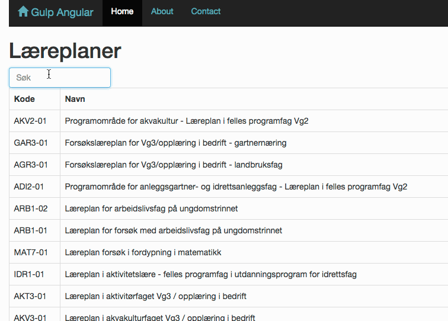

# Kompetansemål i norsk skole
Denne appen lar deg søke og bla gjennom kompetansemål i norsk ungdoms- og
videregående skole. Dette gir deg en enkel oversikt over hvilke kompetansemål
som finnes, hvilken læreplan kompetansemålet tilhører og hvilken *unik* ID
kompetansemålet har.

Dette var laget for bruk til [Kodeklubbens oppgaver], slik at det er mulig å
kategorisere oppgaver etter kompetansemål. Den unike identifikasjonen for hvert
kompetansemål er der brukt som *tags*.

[Kodeklubbens oppgaver]: http://kodeklubben.github.io


## Status
Appen er under utvikling. Prøv den [her](http://arve0.github.io/kompetansemaal/#/).



## Dataressurser
Vi bruker [grep], Utdanningsdirektoretats åpne datatjeneste. Se spesielt
seksjonen om odata i [brukermanualen][grep manual]. Dataressursen er
[tilgjengelig][udir service] som en [angular service].

[grep]: http://grepwiki.udir.no
[grep manual]: http://grepwiki.udir.no/images/1/1e/Brukermanual_for_Grep_soap_odata_rest.pdf
[udir service]: src/app/components/udir/udir.service.js
[angular service]: https://docs.angularjs.org/guide/services

## Utvikle

```sh
git clone https://github.com/arve0/kompetansemaal
cd kompetansemaal
npm install
bower install
gulp serve  # dev build with watch
gulp  # dist build
git checkout gh-pages && sh deploy.sh && git checkout master  # push to gh-pages
```

## Sponsor
Dette er en del av sommerarbeidet i Kodeklubben, sponset av [Sparebank 1 SMN]
og [Studentmediene i Trondheim]. Du kan lese mer om arbeidet på
[kidsakoder.no].

[Sparebank 1 SMN]: https://www.sparebank1.no/smn/
[Studentmediene i Trondheim]: http://www.studentmediene.no/
[kidsakoder.no]: http://www.kidsakoder.no/2015/07/03/kodeklubben-trondheim-utvikler-materiell-i-sommer/
